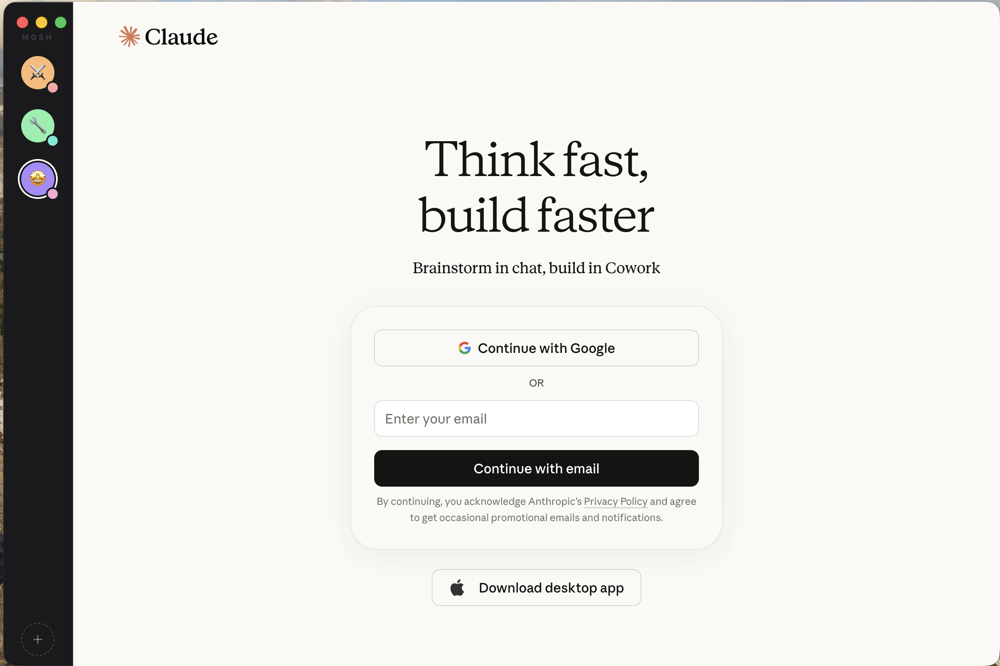

# Mosh

**All your tools in one pit.**

Mosh is a minimal macOS desktop app that runs multiple AI tool accounts side-by-side in one window — switching between them from a slim sidebar. Two Claude accounts, a ChatGPT, a Gemini, a Perplexity. All logged in simultaneously. No browser tabs.



---

## Why

Claude Desktop doesn't support multiple accounts. Switching between a work workspace and personal in a browser kills flow. The same problem exists across every AI tool worth having open all day.

Mosh wraps them all in one app and keeps every session fully isolated.

---

## Features

- **Multi-account, fully isolated** — each account runs in its own Chromium partition. Two Claude accounts can be logged in at the same time.
- **Any web tool** — ships with presets for Claude, ChatGPT, Gemini, Perplexity, Copilot, Grok, and Mistral. Add any URL as a custom account.
- **Emoji icons** — give accounts a custom emoji on a color background so you can tell them apart at a glance.
- **Color tags** — dot indicator on each icon for quick visual scanning.
- **Drag to reorder** — hold and drag to rearrange the sidebar.
- **Right-click to manage** — rename, recolor, change icon, reload, log out, or delete any account.
- **No telemetry, no backend, no cloud** — config lives in a local JSON file. Nothing leaves your machine.

---

## Download

**[Download the latest DMG →](https://github.com/eschnei/mosh/releases/latest)**

macOS only. Universal binary (Apple Silicon + Intel).

> **First launch:** macOS will block the app since it's unsigned. Right-click Mosh.app → Open → Open anyway. You'll only need to do this once.
>
> Or bypass Gatekeeper entirely:
> ```bash
> xattr -dr com.apple.quarantine /Applications/Mosh.app
> ```

---

## Build from source

**Prerequisites:** Node.js 20+, npm

```bash
git clone https://github.com/eschnei/mosh.git
cd mosh
npm install
npm run dev
```

**Package a DMG:**
```bash
npm run dist
```

Output: `dist/Mosh-x.x.x-universal.dmg`

---

## Tech stack

| Layer | Technology |
|---|---|
| Shell | Electron (latest) |
| UI | React + Tailwind CSS + shadcn/ui |
| Persistence | electron-store |
| Build | electron-vite + electron-builder |
| Drag-to-reorder | SortableJS |

No backend. No framework beyond React. Sessions are isolated using Electron's `persist:` partition API — one Chromium profile per account.

---

## Project structure

```
src/
  main/             Electron main process
    index.js        App entry, IPC handlers
    ViewManager.js  WebContentsView lifecycle
    AccountStore.js electron-store wrapper
    services.js     Preset service definitions
  preload/
    index.js        contextBridge API (window.mosh)
  shared/
    ipc-channels.js Channel name constants
  renderer/         React app (sidebar + modals)
    src/
      components/
        Sidebar.jsx
        AccountIcon.jsx
        AddAccountModal.jsx
        IconChooser.jsx
        EmojiPicker.jsx
      assets/icons/services/  SVG service icons
```

---

## Adding a service preset

Edit `src/main/services.js` and add an entry:

```js
{ id: 'myservice', name: 'My Service', url: 'https://myservice.com', defaultIcon: 'myservice.svg' }
```

Add a matching SVG to `src/renderer/src/assets/icons/services/` and export it from the `index.js` there.

---

## Contributing

Issues and PRs welcome. This is a personal tool that scratches a real itch — if it scratches yours too, improvements are appreciated.

A few things worth knowing before contributing:

- **No backend, ever** — Mosh is intentionally local-only. No sync, no accounts, no telemetry.
- **macOS first** — Windows/Linux support is a stretch goal, not a priority.
- **Keep it minimal** — the v2 parking lot is in `plan.md`. New features should clear a high bar.

---

## Roadmap

Things being considered for v2:

- `Cmd+1…9` to jump between accounts
- Unread badge dots
- Workspace folders (group accounts by client/project)
- Global hotkey to summon the app
- Shared prompt library
- Export/import config
- Auto-update

---

## License

MIT
